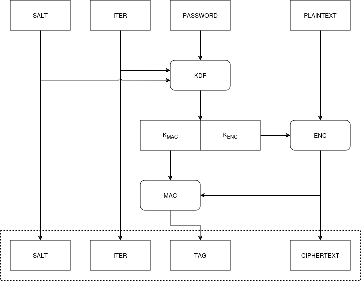

# the_kings_head

Toy TOTP (Time-Based One-Time password) authenticator with an x86-64 assembly language (System V ABI) backend.

This project is a learning exercise in cryptography and x86-64 assembly language.

It should NOT be considered fit for use in any capacity.

It should NOT be used in place of a genuine authenticator app.


## Overview

This project comprises two executables `totpfoo` and `totpgen`, both powered by the library backend `libtkh`.

`totpfoo` is a stand-alone authenticator. It is compiled with a single set of encrypted TOTP parameters. A user-supplied password is required for authentication, decryption and TOTP code generation.

`totpgen` generates encrypted TOTP parameters used in the compilation of `totpfoo`.

The library backend `libkth` is written in x86-64 assembly language (System V ABI).

The project was developed and tested on an Ubuntu 24-04 box.

The project will NOT work with Windows.


## System requirements

System requirements:
- x86-64 cpu with AVX, AVX2, AES-NI and SHA extensions (the majority of CPUs post 2020).
- Linux

Libraries:
- cunit
- gcc
- nasm

On Ubuntu:
```
$ sudo apt install libcunit1 libcunit1-doc libcunit1-dev nasm build-essential gcc
```

## TOTP authenticator usage

The default toy TOTP parameters are:
```
SECRET ASCII: 12345678901234567890
      BASE32: GEZDGNBVGY3TQOJQGEZDGNBVGY3TQOJQ
DIGITS: 8
PERIOD: 30
ALGORITHM: SHA1
```

The default toy TOTP password is:
```
SaturnV
```

Build `totpfoo` with `make`, the executable relative path is `build/bin/`:
```
$ make totp
```

Generate a toy TOTP code using the password:
```
$ ./build/bin/totpfoo SaturnV
```

This assumes that the system clock is accurate.

As the toy default parameters are not secret, the TOTP output codes can be tested via an online generator using said parameters.

https://piellardj.github.io/totp-generator/?secret=GEZDGNBVGY3TQOJQGEZDGNBVGY3TQOJQ&digits=8&period=30&algorithm=SHA-1

NB. Do NOT divulge any private keys online in this manner. Keep private keys secret.


## TOTP authenticator generator usage

NB. This is a toy TOTP generator, it should NOT be used in place of a genuine authenticator app.

The default toy TOTP parameters are defined in `totp-gen.c#main`.:

`totp_gen` 
```C
    // TOTP PARAM
    char *key = "12345678901234567890";
    uint32_t key_len = strlen(key);
    uint32_t n_digits = 8;
    uint32_t period = 30;

    // PBKDF2 ENCRYPT PARAM
    char *pass = "SaturnV";
    uint64_t iter = 1000000;
```

Set the parameters as required and choose a strong password.

Build `totp_gen` with `make`, the executable relative path is `build/bin/`:
```
$ make totp_gen
```
Overwrite the default `totp_blk` parameters:
```
$ ./build/bin/totpgen > res/totp/totp_blk.hex
```
Build `totp_foo` with `make`, the executable relative path is `build/bin/`:
```
$ make totp
```

## Tests

Tests are automatically run during builds, but can be invoked separately:
```
$ make test
...
Suite: AESOFB
  Test: AES256_OFB ...passed
  Test: AES256_OFB_SMALL ...passed
Suite: SHA1
  Test: HMAC_SHA1_1 ...passed
  Test: HMAC_SHA1_2 ...passed
  Test: HMAC_SHA1_3 ...passed
  Test: HMAC_SHA1_4 ...passed
  Test: HMAC_SHA1_5 ...passed
  Test: HMAC_SHA1_6 ...passed
  Test: HMAC_SHA1_7 ...passed
Suite: SHA1
  Test: PBKDF2_HMAC_SHA1_E ...passed
  Test: PBKDF2_HMAC_SHA1_0 ...passed
  Test: PBKDF2_HMAC_SHA1_1 ...passed
  Test: PBKDF2_HMAC_SHA1_2 ...passed
  Test: PBKDF2_HMAC_SHA1_3 ...passed
  Test: PBKDF2_HMAC_SHA1_4 ...passed
  Test: PBKDF2_HMAC_SHA1_5 ...passed
  Test: PBKDF2_HMAC_SHA1_6 ...passed
Suite: SHA1
  Test: SHA1_S ...passed
  Test: SHA1_L ...passed
  Test: SHA1_Permutations ...passed
Suite: SHA1
  Test: TOTP_SHA1_1 ...passed
  Test: TOTP_SHA1_2 ...passed
  Test: TOTP_SHA1_3 ...passed
  Test: TOTP_SHA1_4 ...passed
  Test: TOTP_SHA1_5 ...passed
  Test: TOTP_SHA1_6 ...passed
```

## Parameter block encryption

The encrypted toy TOTP parameter block `totp_blk.hex` is defined as:

```C
typedef struct __attribute__((packed))
{
    uint8_t salt[AES256_KEY_LEN];
    uint8_t hmac[SHA1_MD_LEN];
    uint32_t iter;
    uint8_t param_enc[sizeof(TotpParam)];
} TotpBlk;

```

Parameter block encryption scheme:



```
FUNCTIONS:
ENC = AES256 OFB
KDF = PBKDF2
MAC = HMAC SHA1
```
```

DATA:
CIPHERTEXT = encrypted TOTP parameters
ITER = KDF iteration count
KMAC = 256 bit derived HMAC key *
KENC = 256 bit derived cipher key *
PASSWORD = user-supplied password **
PLAINTEXT = TOTP parameters
SALT = 256 bit *
TAG = HMAC DIGEST

* Assuming a random salt, derived key collision is improbable with identical passwords.
** Assumes a strong brute-force attack resistant password.
```


## X86-64 components

X86-64 (System V ABI) components:
- AES256 OFB
- SHA1
- HMAC SHA1
- PBKDF HMAC SHA1
- TOTP

The assembly language components are written in NASM syntax.

The x86_64 codebase assumes: AVX, AVX2, AES-NI and SHA extensions.

ERMSB support is desirable, but not essential, as `rep movsb` is used for short memory copies.


## License

Licensed under either of

 * Apache License, Version 2.0
   ([LICENSE-APACHE](LICENSE-APACHE) or http://www.apache.org/licenses/LICENSE-2.0)
 * MIT license
   ([LICENSE-MIT](LICENSE-MIT) or http://opensource.org/licenses/MIT)

at your option.


## Resources

Intel® Advanced Encryption Standard (AES) New Instructions Set
<br />
https://www.intel.com/content/dam/doc/white-paper/advanced-encryption-standard-new-instructions-set-paper.pdf

Intel® SHA Extensions
<br />
https://www.intel.com/content/dam/develop/external/us/en/documents/intel-sha-extensions-white-paper-402097.pdf

Advanced Encryption Standard (AES)
<br />
https://nvlpubs.nist.gov/nistpubs/FIPS/NIST.FIPS.197-upd1.pdf

NIST Recommendation for Block Cipher Modes of Operation, Methods and Techniques
<br />
https://nvlpubs.nist.gov/nistpubs/legacy/sp/nistspecialpublication800-38a.pdf

HMAC: Keyed-Hashing for Message Authentication
<br />
https://www.ietf.org/rfc/rfc2104.txt 

Test Cases for HMAC-MD5 and HMAC-SHA-1
<br />
https://www.ietf.org/rfc/rfc2202.txt 

PKCS #5: Password-Based Cryptography Specification Version 2.0
<br />
https://www.ietf.org/rfc/rfc2898.txt

HOTP: An HMAC-Based One-Time Password Algorithm
<br />
https://www.ietf.org/rfc/rfc4226.txt

PKCS #5: Password-Based Key Derivation Function 2 (PBKDF2) Test Vectors
<br />
https://www.ietf.org/rfc/rfc6070.txt

TOTP: Time-Based One-Time Password Algorithm
<br />
https://www.ietf.org/rfc/rfc6238.txt

NIST Cryptographic Algorithm Validation Program
<br />
https://csrc.nist.gov/projects/cryptographic-algorithm-validation-program/block-ciphers
https://csrc.nist.gov/projects/cryptographic-algorithm-validation-program/secure-hashing

Authenticated encryption
<br />
Retrieved: 1st November 2024
<br />
https://en.wikipedia.org/wiki/Authenticated_encryption
